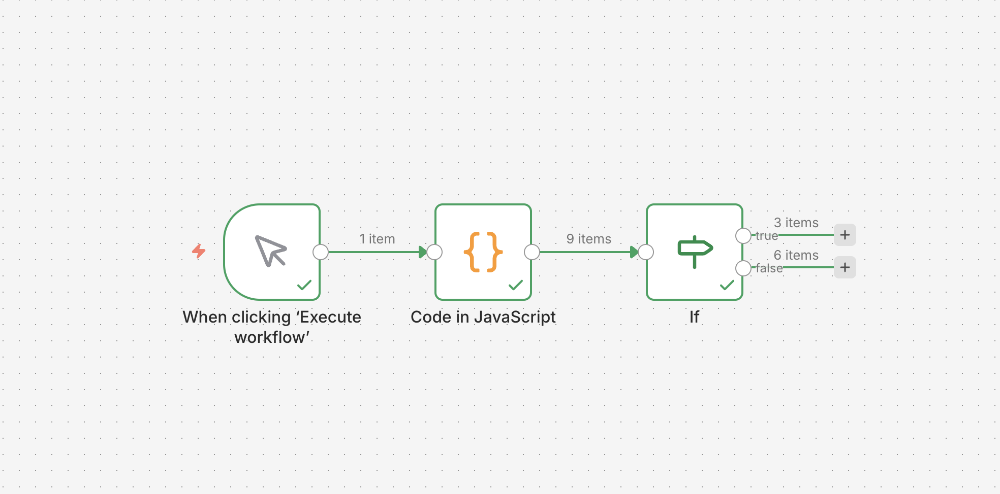

# Automatisierte Rechnungsverarbeitung

## Problem
Manuelle Erfassung von Rechnungsdaten kostet ca. 15 Min. pro Rechnung.

## Lösung
PDF-Rechnungen werden automatisch verarbeitet:
1. Text-Extraktion per pdfplumber
2. Strukturierte Datenextraktion per LLM (Ollama/llama3.2)
3. Datenbereinigung und Speicherung in SQLite-Datenbank
4. Auswertung nach Lieferant und Monat
5. Excel-Report wird automatisch generiert
6. AI Agent (n8n) klassifiziert Rechnungen — Standard oder Prüfung erforderlich

## Tech-Stack
- Python (pdfplumber, pandas, sqlite3)
- LLM-Extraktion (Ollama / llama3.2)
- SQL (SQLite)
- Excel-Automatisierung (openpyxl) — zwei Blätter, bedingte Formatierung
- Power BI Dashboard — in Entwicklung
- AI Agent (n8n) — Klassifizierung mit Human-in-the-Loop
- GitHub Actions (CI/CD) — automatischer Zeitplan, Artefakt-Export

## Projektstruktur

## Excel-Report
Zwei Blätter:
- **Daten** — alle Rechnungen mit Feldern: Rechnungsnr., Datum, Lieferant, Netto, MwSt, Brutto
- **Auswertung** — Ausgaben pro Lieferant und pro Monat. Teuerster Lieferant wird automatisch rot markiert.

## AI Agent (n8n)
Workflow klassifiziert Rechnungen automatisch:
- **Standard** — Brutto unter 2.000€, wird automatisch verarbeitet
- **Prüfung erforderlich** — Brutto über 2.000€, geht zur manuellen Prüfung (Human-in-the-Loop)

## Ergebnisse
- 9 von 15 Rechnungen erfolgreich verarbeitet (LLM-Parsing)
- Extraktionsgenauigkeit: 94,4% (34 von 36 Feldern korrekt)
- Manuelle Erfassung auf unter 1 Min. pro Rechnung reduziert

## Status
- ✅ Schritt 1: PDF-Extraktion (pdfplumber + LLM)
- ✅ Schritt 2: Datenbereinigung + SQLite-Datenbank
- ✅ Schritt 3: Excel-Report (zwei Blätter, bedingte Formatierung)
- ✅ Schritt 4: AI Agent (n8n) — Klassifizierung mit Human-in-the-Loop
- ✅ Schritt 5: GitHub Actions — automatischer Zeitplan, Excel-Report als Artefakt
- ⬜ Schritt 6: Power BI Dashboard (geplant — Windows erforderlich)
- ⬜ Schritt 7: Power Automate (geplant — Windows erforderlich)